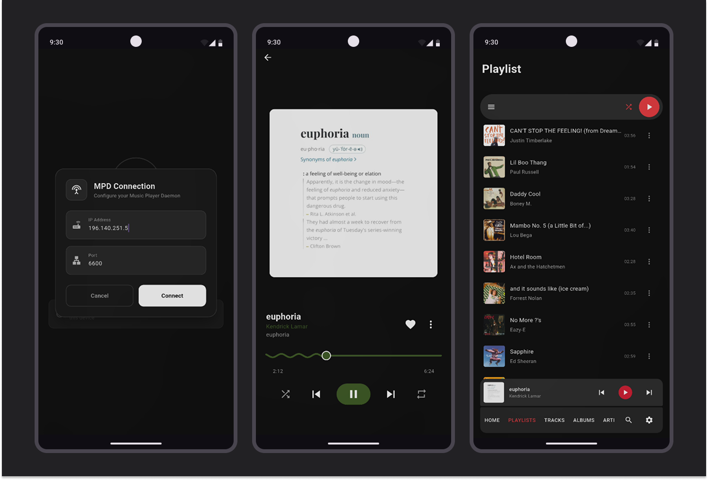

# 🎵 Echo MPD - A Modern MPD Mobile Client

A clean, modern, and feature-rich mobile remote for [MPD (Music Player Daemon)](https://www.musicpd.org/), built with a focus on simplicity, design, and usability. Think **MPDroid** or **MALP**, but reimagined for 2025.

> ⚠️ This project is in **early development** – feedback and ideas are welcome!

---

## ✨ Features (Planned & In Progress)

- 🔹 Modern UI with smooth transitions
- 🔹 Intuitive browsing by artist, album, genre, and playlist
- 🔹 High quality album art support (last.fm)

---

## 📸 Screenshots

> Early preview –

---

## Credits

- **Flutter**
- **dart_mpd** dart package for communication with MPD server

---

## 🧠 Why This Project?

Existing mobile MPD clients like **MALP** and **MPDroid** are powerful but feel outdated in terms of design and user experience. This project aims to bring a **fresh, responsive, and beautiful** remote control app to the MPD ecosystem, built for everyday use in 2025 and beyond.

---

## 🤝 Contributing

Contributions, ideas, and feedback are always welcome!

- 💡 Suggest features or UI improvements
- 🐞 Report bugs and edge cases
- 📱 Test on different devices and share feedback

> To get involved, open an issue or discussion thread. PRs coming soon when the codebase is ready.

---

## 📃 License

[MIT License](LICENSE)

---

## 🙏 Acknowledgments

- [Music Player Daemon](https://www.musicpd.org/)
- Inspiration from MPDroid, MALP, and other FOSS projects

